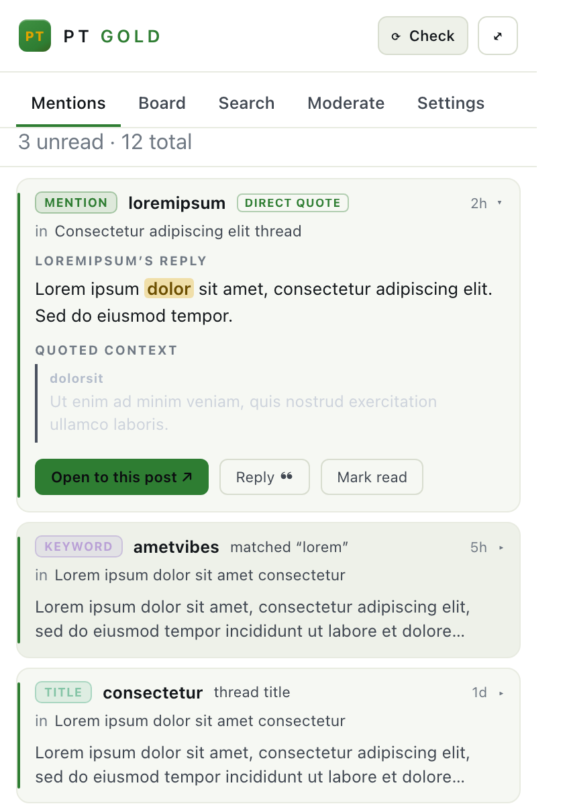
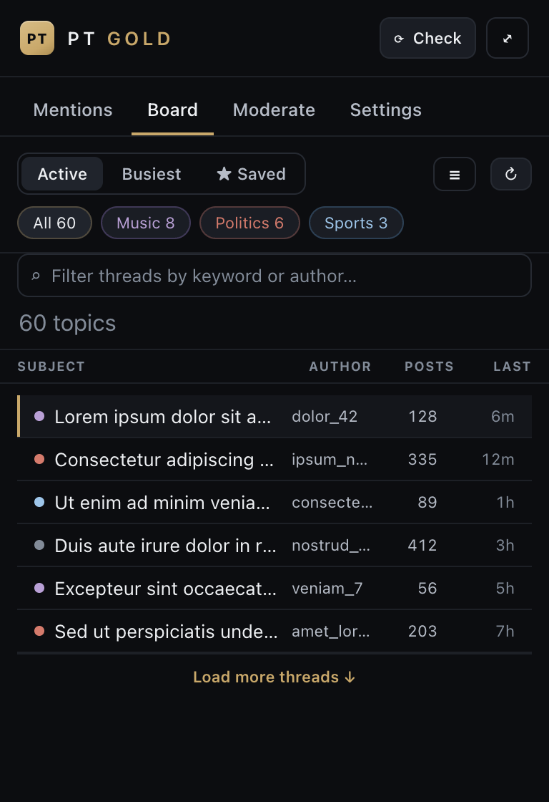
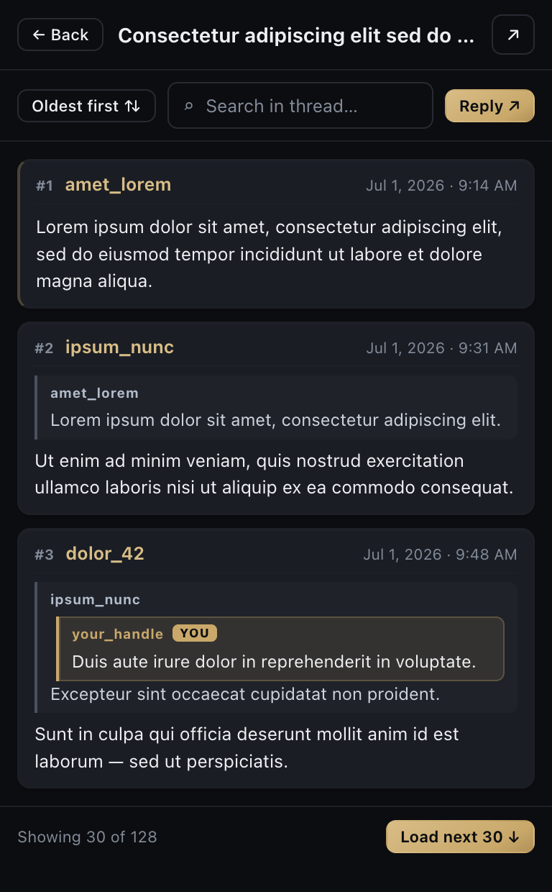

# PT Gold 👑

A power-user companion for the **Phish forum on Phantasy Tour**
(`https://www.phantasytour.com/bands/phish/`). It lives in the **Chrome side
panel** and adds forum-wide mention tracking, a topic board, on-page
moderation, per-thread analytics, and dark/light skins for the site.

Everything runs locally in your browser. The forum's public search/topic APIs
power the data — **no account credentials are ever stored**, and the mention
search even works while you're logged out.

| Mentions | Board | Thread view |
|---|---|---|
|  |  |  |

> Screenshots use placeholder (lorem ipsum) content.

---

## Install

**Chrome / Brave / Edge** (Chromium — the primary target):

1. Open `chrome://extensions` (or `brave://extensions`, `edge://extensions`).
2. Toggle **Developer mode** (top-right).
3. Click **Load unpacked** and select this folder (`pt-gold/`).
4. Click the **PT Gold** toolbar icon — it opens the **side panel**.
5. Open **Settings → Your handle** and enter your forum username to start
   tracking mentions.

> The side-panel UI uses Chrome's `sidePanel` API, so Chromium browsers are the
> supported target. Firefox/Safari would need a sidebar/port adaptation.

---

## Features & how to use them

### 🔔 Mentions — forum-wide mention tracking
The **Mentions** tab is an inbox of every time you're referenced anywhere on the
board. A background worker periodically searches the forum for your handle and
your watch-keywords (using the site's public search), even with no forum tab
open and even when you're logged out.

- **Set it up:** Settings → **Your handle** (your username). Optionally add
  **Watch keywords** (forum-wide phrases to track).
- **Direct vs. nested quotes:** each mention is tagged **Direct quote** (someone
  replied to you directly) or **Nested quote** (you're quoted deeper in a reply
  chain).
- **Read the mention fast:** click a card to expand. It leads with the
  responder's actual reply, then shows the quoted context — **your quoted words
  are highlighted**, and each quote layer is color-coded by depth.
- **Jump to it:** **Open to this post ↗** opens the thread and scrolls straight
  to the exact post (walking pagination if needed).
- **Sort/filter:** segmented **All / Posts / Threads**, an **Unread** filter, and
  a live search box.
- **Keyboard:** `↑ ↓` / `j k` move · `↵` expand · `o` open · `r` read · `x` dismiss.
- **Notifications:** Settings → Notifications has independent toggles for
  **Direct quotes**, **Nested quotes**, **@-mentions**, and **Keyword hits**,
  plus a desktop-notification master and a toolbar unread badge. Set the
  background **Check every** interval and **Look back** window there too.

### 🧭 Board — browse & read the forum in-panel
The **Board** tab is a full forum browser + reader — no need to leave the panel.

- **Table or card view** (toggle), with a **Subject · Author · Posts · Last**
  layout. Sort by **Active** / **Busiest** (or click the column headers).
- **Filter:** a **keyword search** (subject + author) and auto-classified
  **interest-group** chips (Phish, Jam, Politics, Sports, Music, Other).
- **Organize threads:** **★ save** to *My Threads*, **📌 pin** to the top, or
  **⊘ hide** — all persisted locally. **Load more** pages past the first 60.
- **Read inline:** click a thread to expand a **lazy reader** — 30 posts at a
  time, oldest→newest, with the same depth-colored nested-quote rendering as
  Mentions. Toggle **oldest/newest first** and **▴ Collapse**.
- **Thread View:** open any thread (**⤢**) in a **dedicated full-panel view**
  with **Back**, order toggle, **search-within-thread**, paged loading, and
  **Reply** (native in-panel posting is in progress). Correct **UTC** post times.

### 🛡️ Moderate — hide content on the forum
The **Moderate** tab is your personal filter. As you browse the forum it hides
anything matching your rules.

- **Enable hiding**, then add **Blocked handles** and/or **Blocked keywords**.
- It hides matching **threads**, **posts**, and **posts that quote a blocked
  handle** (quoted nests) — applied live as the Knockout-rendered pages update.

### 🎨 Skins — reskin the forum (and the panel)
Settings → **Site appearance**: **Original**, **Dark**, or **Light**.

- **Dark** gives the whole forum a charcoal theme with separated, neon-accented
  post cards. **Light** is a clean grey/white theme (no green/yellow).
- The chosen skin also themes the extension's own side panel.
- Applies live to open forum tabs.

---

## Privacy

- **No credentials stored.** Background checks use the forum's *public* search
  API; nothing reads or saves your login token.
- **Local only.** Your handle, keywords, and inbox live in `chrome.storage` on
  your machine. Nothing is sent anywhere except normal requests to the forum
  itself.
- Background polling runs only while your browser is open, on the interval you
  set, scoped to your watch terms.

---

## Files

- `manifest.json` — MV3 config (side panel, alarms, notifications, host access)
- `background.js` — search poller, inbox store, notifications, toolbar badge
- `dashboard.html/css/js` — the side-panel app (Mentions · Board · Moderate · Settings)
- `theme.css` — shared design tokens (incl. the light theme)
- `content.js` / `content.css` — moderation (hide blocked content)
- `harvest.js` — deep-link "jump to exact post" on thread pages
- `discover.js` — learns the forum's API endpoints at runtime
- `skin.js` / `skin.css` — forum dark/light skins
- `docs/` — README screenshots (placeholder content)
