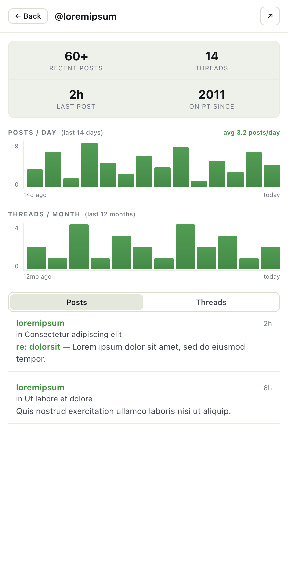
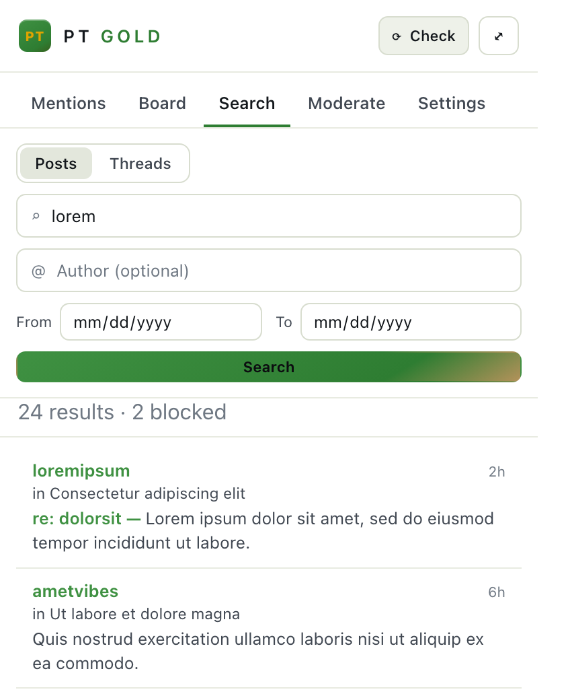
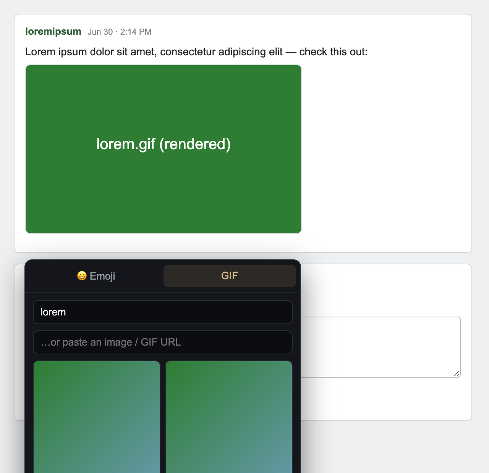

# PT Gold 👑

A Chrome side-panel companion for the **Phish forum on Phantasy Tour**. It tracks
every mention of you across the board, gives you a fast in-panel reader for
browsing and posting, turns image links into actual images, and lets you research
any user — all without leaving the panel.

It runs entirely in your browser. Read-only features use the forum's public
search, so mention tracking works even when you're logged out; anything tied to
your account (posting, your followed threads) just rides your normal login.
**No credentials are ever stored.**

| Mentions | Board | Thread reader |
|---|---|---|
|  |  |  |

| Profile | Search | On-site images & GIFs |
|---|---|---|
|  |  |  |

> Screenshots use placeholder (lorem ipsum) content — no real handles or posts.

## Install

1. Open `chrome://extensions`, turn on **Developer mode**.
2. **Load unpacked** → pick this folder.
3. Click the **PT Gold** toolbar icon to open the side panel, then set your handle
   in **Settings** to start tracking mentions.

Chromium only (Chrome/Brave/Edge) — it relies on the `sidePanel` API.

## What it does

**Mentions.** A background worker searches the forum for your handle and watch
keywords and drops every hit in an inbox — tagged direct quote, nested quote,
@-mention, or keyword. Expand a card to read the reply with your quoted words
highlighted and each quote layer color-coded by depth, reply right there in the
card, or jump to the exact post. Full keyboard nav, desktop notifications, and an
unread badge.

**Board & reader.** Browse topics in a table or cards, sorted by activity, filtered
by keyword or interest group. Save, pin, or hide threads, or pull the threads you
follow on your account under **My Threads**. Click one and it expands into a
focused reader — the rest of the board dims — with per-post quoting and a reply
box at the bottom. Any thread also opens full-panel with search-within-thread.

**Posting.** Reply, quote, or start a thread straight from the panel. Quotes show
up as a formatted, editable block (not raw BBCode) and convert back on send. If
your login has lapsed, it tells you instead of failing silently.

**Profile research.** Click any handle for a rundown of that user: posts/day and
threads/month charts, "on PT since," and tabs of their recent posts and threads.

**Images & GIFs.** The forum shows image links as plain text — PT Gold renders
them inline in the reader, and optionally on the live site too. Every post box
(in the panel *and* injected onto the forum's own reply box) gets an emoji picker
and Giphy search.

**Moderate.** Block handles or keywords and matching threads, posts, and quoted
nests disappear — both on the forum and everywhere in the panel.

**Themes.** Original (white/green/gold), Dark, or Light — panel only; the forum is
never restyled.

## Privacy

Read-only data comes from the forum's public API; account actions ride your own
logged-in session. Your handle, keywords, and inbox stay in `chrome.storage` on
your machine. GIF *search* uses your own free Giphy key (emoji and pasted URLs
need nothing). Background polling only runs while your browser is open.

---

See `CLAUDE.md` for architecture and build notes, and `docs/API.md` for the forum
API details.
